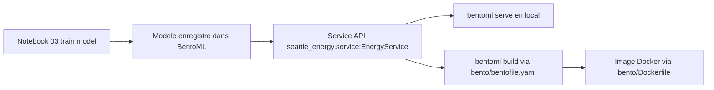

# Conso Batiment (Seattle 2016) - Student Guide

Ce projet couvre un pipeline ML complet: preparation des donnees, feature engineering, entrainement, puis exposition d une API de prediction avec BentoML.

## 1) Prerequis

- Python 3.11
- Git
- pip ou Poetry

Verification rapide:

```bash
python --version
git --version
```

## 2) Installation

### Option A - venv + pip

```bash
python -m venv .venv
```

Activation:

- Windows PowerShell

```powershell
.venv\Scripts\Activate.ps1
```

- macOS / Linux

```bash
source .venv/bin/activate
```

Puis:

```bash
pip install -r requirements.txt
```

### Option B - Poetry

```bash
pip install poetry
poetry install
poetry shell
```

## 3) Workflow notebooks

Executer les notebooks dans cet ordre:

1. notebooks/00_exploratory_analysis.ipynb
2. notebooks/01_clean_data.ipynb
3. notebooks/02_feature_engineering.ipynb
4. notebooks/03_train_model.ipynb
5. notebooks/04_run_service.ipynb
6. notebooks/05_test_api.ipynb

## 4) BentoML: c est quoi, et a quoi ca sert?

BentoML est un framework de mise en production de modeles ML.

L idee principale:
- ton notebook entraine un modele,
- BentoML enregistre ce modele,
- puis BentoML l expose comme une API HTTP,
- enfin BentoML permet de packager le tout pour un deploiement stable.

Pourquoi c est utile:
- eviter de recoder une API manuellement autour du modele
- standardiser le passage de experimentation a production
- garder le meme comportement entre local, Docker et serveur
- versionner les modeles (ex: random_forest_energy:latest)

Concretement, BentoML sert a:
- enregistrer le modele entraine dans un model store local
- exposer des endpoints API (ex: /predict, /ping)
- packager le service avec sa configuration dans un artefact deployable (un Bento)
- faciliter la containerisation et le deploiement

Dans ce projet:
- le service API est defini dans src/seattle_energy/service.py
- la configuration Bento est dans bento/bentofile.yaml
- le conteneur est defini dans bento/Dockerfile

Cycle de vie BentoML dans ce repo:
1. entrainer le modele
2. sauvegarder le modele dans BentoML
3. lancer l API avec bentoml serve
4. construire un Bento avec bentoml build
5. deployer en Docker

Schema rapide du flux BentoML:



## 5) Comment activer et lancer BentoML

### 5.1 Activer l environnement Python

Avant toute commande BentoML, active ton environnement:

- venv: .venv\Scripts\Activate.ps1 (Windows)
- ou poetry shell

### 5.2 Verifier BentoML

```bash
bentoml --version
bentoml models list
```

### 5.3 Entrainer et enregistrer le modele

```bash
python -c "from seattle_energy.model_training import train_and_save; train_and_save()"
```

Cette etape doit creer le modele random_forest_energy:latest dans BentoML.

### 5.4 Lancer le service API BentoML

```bash
bentoml serve seattle_energy.service:EnergyService --reload
```

API locale:

- http://localhost:3000

### 5.5 Tester l API

Dans un second terminal (environnement active):

```bash
python old_scripts/test_api.py
```

## 6) Construire un Bento

Depuis la racine du projet:

```bash
bentoml build --bentofile bento/bentofile.yaml
```

## 7) Docker (fichiers Bento ranges dans bento/)

Le Dockerfile est maintenant dans bento/Dockerfile.

Build image:

```bash
docker build -f bento/Dockerfile -t seattle-energy-service .
```

Run container:

```bash
docker run -p 3000:3000 seattle-energy-service
```

## 8) Arborescence

```text
dataprojet6/
├── bento/
│   ├── bentofile.yaml
│   └── Dockerfile
├── data/
│   ├── raw/
│   └── processed/
├── notebooks/
├── src/
│   └── seattle_energy/
│       ├── data_processing.py
│       ├── model_training.py
│       └── service.py
├── tests/
├── documentation/
├── pyproject.toml
└── requirements.txt
```

## 9) Documentation (dossier dedie)

Le dossier documentation est versionne dans ce depot.

Document present:
- documentation/MissionDataEngineeringCEBSeattle.pdf

## 10) Remarques

- Aucun resultat numerique final n est fourni: il faut executer le pipeline.
- Si bentoml serve echoue, verifier d abord que le modele est bien enregistre avec bentoml models list.
